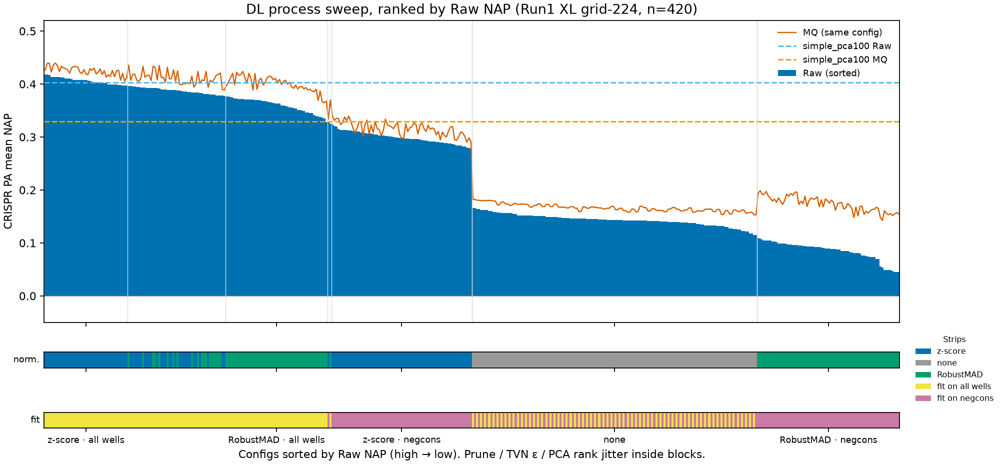
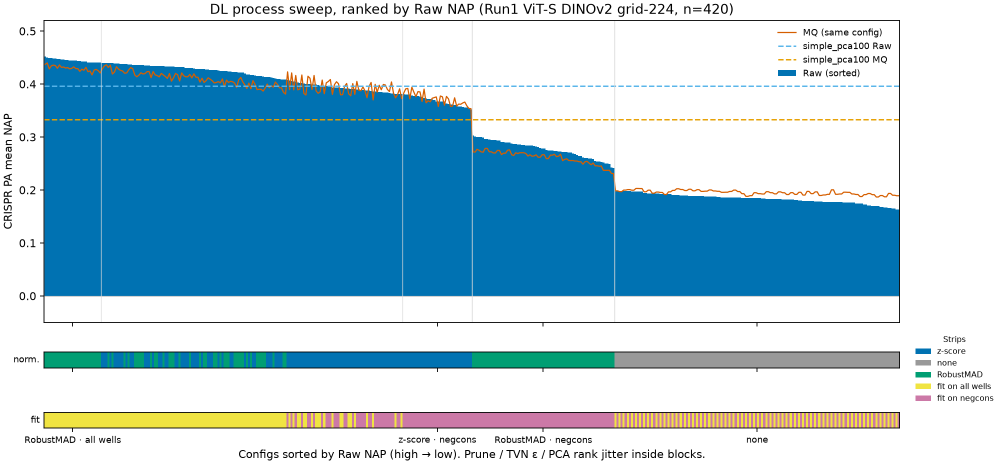

# Wave R: processing vs JUMP-lite MQ on timm cell crops

Date: 2026-09-17.
Card: EfficientNetV2-XL, 96 px `cell_fixed` crops, five stains, site-median
pool, Run1 CRISPR, JUMP-lite 4-site keys.
Endpoint: CRISPR phenotypic activity, mean NAP (`evaluate --tasks pa --subset
crispr`). Random retrieval is 0. Material on Run1 if \|ΔNAP\| ≥ 0.03.

This is the declared Raw-vs-MQ **timm analogue** ([H13](hypotheses.md#h13--compression-robustness-headline-inherits-flawed-embedding-evaluation)),
not a Table 1 Raw/HQ/MQ/D20 restudy and not the paper’s 0.815 CRISPR PA
figure. Living verdicts stay in [hypotheses.md](hypotheses.md). Commands
also live in [campaign.md](campaign.md).

## Setup

| Knob | Value |
|---|---|
| Model | `timm` / `tf_efficientnetv2_xl.in21k` / pretrained / bag-of-channels |
| Channels | AGP, DNA, ER, Mito, RNA (`jump_lite_as_run`) |
| Crop | `--crop cell_fixed --crop-size 96 --pool site` |
| Sites | `--sites jump_lite` |
| Cohort | `--subset crispr --batch 20220914_Run1` |
| Raw pixels | streamed Orig TIFF (`--image-source s3`) |
| MQ pixels | streamed JUMP-lite `jpegxl_lossy_mq.zarr` (`--image-source s3_mq`) |
| Wells scored | 336 CRISPR perturbations after PCA/TVN or `simple_pca100` |
| Sites in both parquets | 35,398 (inner-join on `site_key`) |

MQ skipped 119 CPG zarr holes (`n_sites_skipped_no_image`). Aggregate both
arms with `--keep-sites-from` the peer run. On this pair the filter dropped
**0** extra sites (Raw already lacked those 119).

Campaign readout is now `simple_pca100` (PCA-100, then per-plate z-score
on negcons; no TVN). `paper_dl_default` and `sweep_paper_dl_v11_lite` are
comparators so process and codec are not changed at the same time.

## Findings

### 1. The paper DL recipe tanks this card (H6, mixed)

Same Raw well profiles:

| Process | Mean NAP | Median NAP |
|---|---:|---:|
| `simple_pca100` | 0.453 | 0.398 |
| Sweep winner | 0.420 | — |
| `paper_dl_default` | 0.038 | −0.149 |

`sweep_paper_dl_v11_lite` is 420 configs (normalize × fit-on-controls ×
prune × TVN ε × PCA rank). On Raw it spans **0.030–0.420** (median 0.208).
`paper_dl_default` (RobustMAD fit on negcons, PCA-128, TVN ε=0.5) is rank
**393/420**. Every RobustMAD-on-negcons config is ≤ 0.052. Z-score fit on
all wells sits at 0.38–0.42.

The reachable H6 test (“does the DL grid move *timm* CRISPR PA?”) is yes,
by ≫ 0.03. CP INT / independent-set prune is still untested.

Raw sweep winner:
`standardize`, `fit_on_controls=false`, prune, `tvn_epsilon=0.05`,
PCA-170
(`standardize_fitctrl-false_prune-true_eps-0.05_pca-170`).

### 2. MQ loses signal on the campaign readout (H13, mixed)

| Process | Raw | MQ | Δ (MQ−Raw) |
|---|---:|---:|---:|
| `simple_pca100` | 0.453 | 0.332 | **−0.120** |
| Sweep winners (picked separately) | 0.420 | 0.404 | −0.017 |
| Raw-winner config, scored on MQ | 0.420 | 0.393 | −0.028 |
| `paper_dl_default` (sweep shard) | 0.038 | 0.116 | +0.078 |

`simple_pca100` Δ is material. Stop further MQ OFAT on this card; later
OFAT stays on Raw/stream.

Do **not** use an older `data/results/campaign/run1_xl_c96_mq.json` (NAP
0.340). That file is `paper_dl_default` from before the site-intersected
profiles. The matched shard on these profiles is 0.116.

### 4. Grid 224 XL / ViT (same sites, `simple_pca100`)

2026-09-18. Cell and grid arms, aggregated with `--keep-sites-from` Wave R
cell-96 XL Raw (35,398 keys; 336 CRISPR perturbations).

Consolidated `simple_pca100` (PCA-100 → per-plate negcon z-score), Run1
CRISPR, 336 perturbations, all site-intersected to the Wave R cell-96 XL
Raw keys:

| Crop (window) | Architecture | Raw mean | Raw median | MQ mean | MQ median | Δ mean (MQ−Raw) |
|---|---|---:|---:|---:|---:|---:|
| `cell_fixed` 96 | EfficientNetV2-XL | 0.453 | 0.398 | 0.332 | 0.193 | **−0.120** |
| `cell_fixed` 224 | EfficientNetV2-XL | 0.425 | 0.298 | — | — | — |
| `grid` 96 | EfficientNetV2-XL | 0.399 | 0.296 | — | — | — |
| `grid` 224 | EfficientNetV2-XL | 0.403 | 0.283 | 0.329 | 0.147 | **−0.073** |
| `grid` 224 | ViT-S DINOv2 (timm) | 0.397 | 0.294 | 0.333 | 0.193 | **−0.063** |

JSON: `data/results/campaign/{run1_xl_c96,timm_run1_xl_c224,timm_run1_xl_g96,timm_run1_xl_g224,timm_run1_vit_g224}_{raw,mq}_simple_pca100.json`.

| Contrast | Δ mean NAP | Material (≥0.03)? |
|---|---:|---|
| XL cell-96 vs grid-224, Raw | +0.050 | yes |
| XL cell-96 vs grid-224, MQ | +0.003 | no |
| XL vs ViT, grid-224 Raw | +0.006 | no |
| XL vs ViT, grid-224 MQ | −0.004 | no |
| XL grid Raw vs MQ | −0.073 | yes |
| ViT grid Raw vs MQ | −0.063 | yes |

Cell vs grid is confounded with window size (H14). H12 analogue is
`simple_pca100`, not `paper_dl_default`.

### 5. Grid-224 DL sweep: MQ direction depends on architecture (H13)

2026-09-21. Same `sweep_paper_dl_v11_lite` grid (420 configs) run on the
grid-224 Raw/MQ profiles, site-intersected to the Wave R cell-96 Raw keys
(35,398). Raw and MQ profiles hold the same `site_key` set, so wells are
4-site on both arms. `simple_pca100` MQ is worse on both cards, but the DL
grid does not agree with it for XL.

| Crop | Architecture | Raw max | MQ max | Δ mean (MQ−Raw) | Median Δ | Configs MQ>Raw | `simple_pca100` Raw → MQ |
|---|---|---:|---:|---:|---:|---:|---|
| `grid` 224 | EfficientNetV2-XL | 0.418 | 0.440 | **+0.035** | +0.024 | 415/420 | 0.403 → 0.329 (−0.073) |
| `grid` 224 | ViT-S DINOv2 | 0.452 | 0.440 | **−0.003** | −0.006 | 187/420 | 0.397 → 0.333 (−0.063) |

- **ViT-S DINOv2** behaves like cell-96 XL: the `simple_pca100` drop is
  material (−0.063), the DL grid is near-neutral (only 1 config with
  \|Δ\| ≥ 0.03), and the families that carry signal (`robustmad` /
  `standardize`, fit-on-all-wells) are uniformly MQ < Raw.
- **EfficientNetV2-XL** reverses: MQ ≥ Raw on 415/420 configs (mean
  +0.035), largest in `robustmad` fit-on-controls (+0.089). Yet its
  `simple_pca100` still loses on MQ (−0.073). Treat this arm as
  **unresolved**: the sign depends on process, and the families that
  inflate MQ (`robustmad` fit-on-controls) are exactly the ones that
  already sign-flipped on cell-96.

Family means (Δ = MQ − Raw; `fitctrl` = `fit_on_controls`):

| Architecture | `standardize`/all | `robustmad`/all | `standardize`/negcons | `none` | `robustmad`/negcons |
|---|---:|---:|---:|---:|---:|
| XL grid-224 | +0.018 | +0.039 | +0.017 | +0.023 | +0.089 |
| ViT grid-224 | −0.014 | −0.019 | +0.006 | +0.012 | −0.016 |

Raw sweep winner / MQ sweep winner:

- XL: `standardize_fitctrl-false_prune-true_eps-0.05_pca-196`
  (Raw 0.418 / MQ 0.426); MQ winner
  `standardize_fitctrl-false_prune-false_eps-0.1_pca-304` (Raw 0.413 / MQ 0.440).
- ViT: `robustmad_fitctrl-false_prune-true_eps-0.05_pca-304`
  (Raw 0.452 / MQ 0.437); MQ winner
  `robustmad_fitctrl-false_prune-false_eps-0.05_pca-304` (Raw 0.450 / MQ 0.440).





420 configs sorted by Raw CRISPR PA mean NAP; MQ is the same process config
(not re-ranked). Dashed lines are `simple_pca100`. Generate with the
`--raw/--mq/--simple-raw/--simple-mq/--title` block in
[Reproduce → Waterfall figure](#waterfall-figure).

### 3. The MQ drop is not an artifact of switching process

Independently selected TVN winners miss the 0.03 bar (Δ −0.017). Matched
configs that actually keep signal still have MQ below Raw:

- All **70** configs with Raw NAP ≥ 0.38 are worse on MQ (median Δ −0.025,
  range −0.011 to −0.036; 19 of them ≤ −0.03).
- MQ sweep winner
  (`standardize_fitctrl-false_prune-false_eps-0.05_pca-304`) is 0.404;
  that same config is 0.418 on Raw (Δ −0.014).
- `paper_dl_default` still flips sign because it destroys Raw, not because
  MQ is better.

So: MQ is consistently a bit worse when the process preserves phenotype;
`simple_pca100` amplifies that past 0.03; the paper DL default is not a
fair codec comparison.

MQ sweep range: 0.086–0.404 (median 0.223).


420 `sweep_paper_dl_v11_lite` configs, sorted by Raw CRISPR PA mean NAP; MQ is the same process config (not re-ranked). Dashed lines are `simple_pca100`. The x-axis is the `normalize` × fit-on-negcons blocks that appear after that sort; prune, TVN ε, and PCA rank jitter inside blocks. Generate with `python scripts/plot_sweep_waterfall.py`.

## Result files

All under `data/` (gitignored):

```text
data/profiles/timm_run1_xl_c96_{raw,mq}.parquet
data/profiles/timm_run1_xl_c96_{raw,mq}.parquet.site_filter.json
data/processed/timm_run1_xl_c96_raw_simple_pca100.parquet
data/processed/timm_run1_xl_c96_mq_simple_pca100.parquet
data/results/campaign/run1_xl_c96_raw_simple_pca100.json
data/results/campaign/run1_xl_c96_mq_simple_pca100.json
data/results/campaign/timm_run1_xl_c96_raw_dl_sweep/summary.csv
data/results/campaign/timm_run1_xl_c96_mq_dl_sweep/summary.csv
data/profiles/timm_run1_xl_g224_{raw,mq}.parquet
data/profiles/timm_run1_vit_g224_{raw,mq}.parquet
data/results/campaign/timm_run1_xl_g224_{raw,mq}_simple_pca100.json
data/results/campaign/timm_run1_vit_g224_{raw,mq}_simple_pca100.json
data/results/campaign/timm_run1_xl_c224_raw_simple_pca100.json
data/results/campaign/timm_run1_xl_g96_raw_simple_pca100.json
data/results/campaign/timm_run1_xl_g224_{raw,mq}_dl_sweep/summary.csv
data/results/campaign/timm_run1_vit_g224_{raw,mq}_dl_sweep/summary.csv
```

## Reproduce

Needs GPU for embed, CPU for process/evaluate/sweep. Streamed S3; do not
write Orig TIFFs next to local `.jxl`. `--jobs 16` pins one BLAS thread
per process.

### Embed (skip if the run dirs already have `site_embeddings.parquet`)

```bash
jumpbench embed --model timm --image-source s3 \
  --subset crispr --sites jump_lite --batch 20220914_Run1 \
  --crop cell_fixed --crop-size 96 --pool site \
  --run-dir data/embeddings/timm/run1/cell_fixed_jump_lite_96_efficientnetv2_xl_5ch_raw \
  --set models.timm.architecture=tf_efficientnetv2_xl.in21k \
  --set runtime.batch_size=64

jumpbench embed --model timm --image-source s3_mq \
  --subset crispr --sites jump_lite --batch 20220914_Run1 \
  --crop cell_fixed --crop-size 96 --pool site \
  --run-dir data/embeddings/timm/run1/cell_fixed_jump_lite_96_efficientnetv2_xl_5ch_jpegxl_mq \
  --set models.timm.architecture=tf_efficientnetv2_xl.in21k \
  --set runtime.batch_size=64
```

### Same sites, then `simple_pca100`

```bash
RAW=data/embeddings/timm/run1/cell_fixed_jump_lite_96_efficientnetv2_xl_5ch_raw
MQ=data/embeddings/timm/run1/cell_fixed_jump_lite_96_efficientnetv2_xl_5ch_jpegxl_mq

jumpbench aggregate \
  --input $RAW/site_embeddings.parquet \
  --keep-sites-from $MQ \
  --output data/profiles/timm_run1_xl_c96_raw.parquet

jumpbench aggregate \
  --input $MQ/site_embeddings.parquet \
  --keep-sites-from $RAW \
  --output data/profiles/timm_run1_xl_c96_mq.parquet

jumpbench process --preset simple_pca100 \
  --input data/profiles/timm_run1_xl_c96_raw.parquet \
  --output data/processed/timm_run1_xl_c96_raw_simple_pca100.parquet
jumpbench evaluate --tasks pa --subset crispr \
  --input data/processed/timm_run1_xl_c96_raw_simple_pca100.parquet \
  --output data/results/campaign/run1_xl_c96_raw_simple_pca100.json

jumpbench process --preset simple_pca100 \
  --input data/profiles/timm_run1_xl_c96_mq.parquet \
  --output data/processed/timm_run1_xl_c96_mq_simple_pca100.parquet
jumpbench evaluate --tasks pa --subset crispr \
  --input data/processed/timm_run1_xl_c96_mq_simple_pca100.parquet \
  --output data/results/campaign/run1_xl_c96_mq_simple_pca100.json
```

Expect Raw CRISPR PA NAP ≈ 0.453 and MQ ≈ 0.332.

### Same profiles, paper DL default (optional comparator)

```bash
jumpbench process --preset paper_dl_default \
  --input data/profiles/timm_run1_xl_c96_raw.parquet \
  --output data/processed/timm_run1_xl_c96_raw.parquet
jumpbench evaluate --tasks pa --subset crispr \
  --input data/processed/timm_run1_xl_c96_raw.parquet \
  --output data/results/campaign/run1_xl_c96_raw.json

jumpbench process --preset paper_dl_default \
  --input data/profiles/timm_run1_xl_c96_mq.parquet \
  --output data/processed/timm_run1_xl_c96_mq.parquet
jumpbench evaluate --tasks pa --subset crispr \
  --input data/processed/timm_run1_xl_c96_mq.parquet \
  --output data/results/campaign/run1_xl_c96_mq.json
```

Expect Raw ≈ 0.038. MQ on these profiles ≈ 0.116 (sweep shard), not 0.340.

### Same profiles, 420-config DL sweep

Grid parent is still `--preset paper_dl_default`; axes override it
(`configs/process.yaml` `sweep_paper_dl_v11_lite`).

```bash
jumpbench sweep run --grid sweep_paper_dl_v11_lite --preset paper_dl_default \
  --input data/profiles/timm_run1_xl_c96_raw.parquet \
  --processed-dir data/processed/timm_run1_xl_c96_raw_dl_sweep \
  --results-dir data/results/campaign/timm_run1_xl_c96_raw_dl_sweep \
  --jobs 16 --subset crispr --tasks pa
jumpbench sweep gather --results-dir data/results/campaign/timm_run1_xl_c96_raw_dl_sweep

jumpbench sweep run --grid sweep_paper_dl_v11_lite --preset paper_dl_default \
  --input data/profiles/timm_run1_xl_c96_mq.parquet \
  --processed-dir data/processed/timm_run1_xl_c96_mq_dl_sweep \
  --results-dir data/results/campaign/timm_run1_xl_c96_mq_dl_sweep \
  --jobs 16 --subset crispr --tasks pa
jumpbench sweep gather --results-dir data/results/campaign/timm_run1_xl_c96_mq_dl_sweep
```

Completed JSONs are skipped unless `--force`. On this machine each sweep was
about 2.5 hours at 16 jobs.

Matched Raw-winner on MQ (no extra embed):

```bash
jumpbench process --preset paper_dl_default \
  --set normalize=standardize \
  --set fit_on_controls=false \
  --set prune_correlated=true \
  --set tvn_epsilon=0.05 \
  --set pca_components=170 \
  --input data/profiles/timm_run1_xl_c96_mq.parquet \
  --output data/processed/timm_run1_xl_c96_mq_raw_winner.parquet
jumpbench evaluate --tasks pa --subset crispr \
  --input data/processed/timm_run1_xl_c96_mq_raw_winner.parquet \
  --output data/results/campaign/run1_xl_c96_mq_raw_winner.json
```

That shard already exists as
`data/results/campaign/timm_run1_xl_c96_mq_dl_sweep/standardize_fitctrl-false_prune-true_eps-0.05_pca-170.json`
(NAP 0.393).

### Waterfall figure

```bash
# cell-96 XL (defaults)
python scripts/plot_sweep_waterfall.py
# docs/figures/wave_r_sweep_waterfall.png
# docs/figures/wave_r_sweep_waterfall.svg

# grid-224 XL
python scripts/plot_sweep_waterfall.py \
  --raw  data/results/campaign/timm_run1_xl_g224_raw_dl_sweep/summary.csv \
  --mq   data/results/campaign/timm_run1_xl_g224_mq_dl_sweep/summary.csv \
  --simple-raw data/results/campaign/timm_run1_xl_g224_raw_simple_pca100.json \
  --simple-mq  data/results/campaign/timm_run1_xl_g224_mq_simple_pca100.json \
  --png docs/figures/wave_r_sweep_waterfall_g224.png \
  --svg docs/figures/wave_r_sweep_waterfall_g224.svg \
  --title "DL process sweep, ranked by Raw NAP (Run1 XL grid-224, n=420)"

# grid-224 ViT-S DINOv2
python scripts/plot_sweep_waterfall.py \
  --raw  data/results/campaign/timm_run1_vit_g224_raw_dl_sweep/summary.csv \
  --mq   data/results/campaign/timm_run1_vit_g224_mq_dl_sweep/summary.csv \
  --simple-raw data/results/campaign/timm_run1_vit_g224_raw_simple_pca100.json \
  --simple-mq  data/results/campaign/timm_run1_vit_g224_mq_simple_pca100.json \
  --png docs/figures/wave_r_sweep_waterfall_vit_g224.png \
  --svg docs/figures/wave_r_sweep_waterfall_vit_g224.svg \
  --title "DL process sweep, ranked by Raw NAP (Run1 ViT-S DINOv2 grid-224, n=420)"
```
